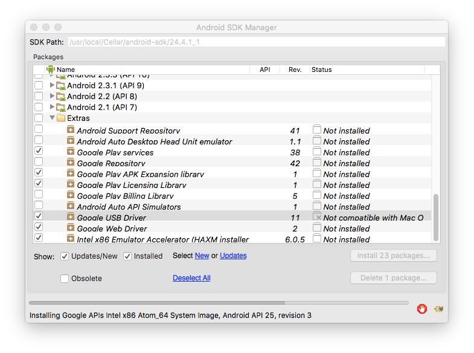
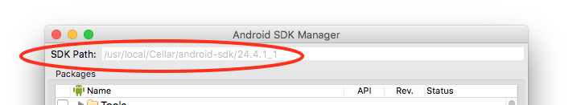
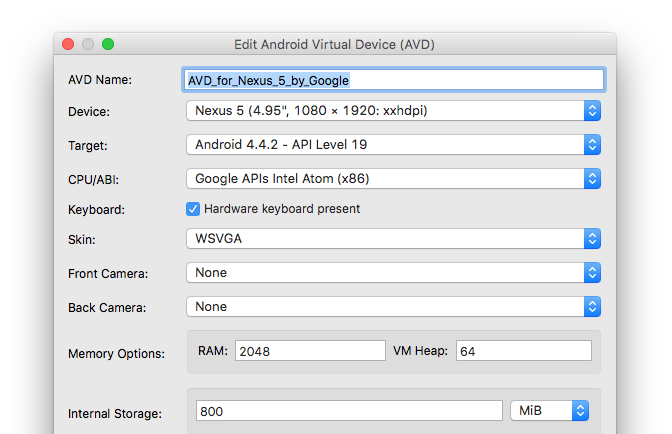

# Android Emulator Setup for Mac OS X

This guide shows you how to use the Android SDK to create a virtual android device.

## Installation of SDK command line tools

### Use homebrew (recommended)
* Execute `brew install android-sdk`

### Install manually
* Go to the [Download Page](https://developer.android.com/studio/index.html#downloads)
* Download the Command Line Tools
* Install them on your own

## Install emulator requirements
* Run `android` in your Terminal to start the UI
* In the following screen, select the tools that you need and install them 
* What do you need?
  * Android SDK
  * At least one Android OS version
  * Intel x86 Emulator Accelerator (under _Extras_)

_**Note:**_ The emulator accelerator HAXM may not be installed right away (you may notice later, when you try to start the device.) Install HAXM manually from the "Extra" folder where it has been downloaded. You find the path of the folder on the top of the SDK manager window:

## Create an _Android Virtual Device (AVD)_
* In the menu bar, go to _Tools_ -> _Manage AVDs..._
* Switch to the tabulator _Device Definitions_
* Select the device definition you need and click _Create AVD..._ on the right
* Here is what my example device definition looks like: 
* Confirm your setup
* You can start your device by going to the tabulator _Android Virtual Devices_, selecting your device and click on _Start..._

## Nice to know

### How to install an app from an _apk_ file
* List all device names with `adb devices`
* Install app by using `adb -s <device name> install XXXXXXX.apk`

### Start Android Virtual Device from command line
* Type `android list avd` into the shell, which lists you all the device's names
* Use `emulator -avd <device name>` to start a device

**Tip:** [Read more](https://developer.android.com/studio/command-line/adb.html) about the _Android Debug Bridge_ (`adb`) command

-----------

This guide was created by [Benedikt Roßgardt](mailto:benedikt@freeletics.com) in January of 2017

